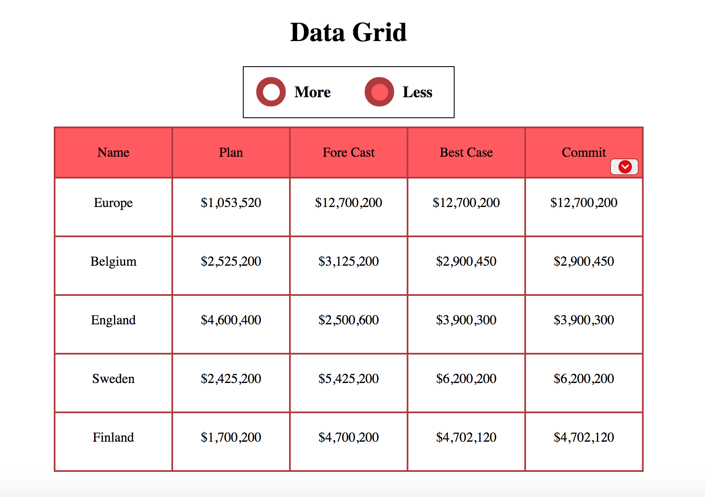

# Data Grid

[DataGrid Link](https://hellojohnito.github.io/datagrid/)

Data Grid is an application that formats JSON objects into a data table. Written in Vanilla JavaScript, CSS, and HTML.

## File order:
 - json.js
 - table.js
 - dropdown.js
 - more_less_selector.js
 - app.js

## Features & Implementation
- Displays / hides certain elements in the data grid based on selection (more or less),
- Implements sorting both ascending and descending for each column by clicking on the column header.
- Implements a drop down menu with checkboxes. Restricts users to select maximum of 5 columns.
